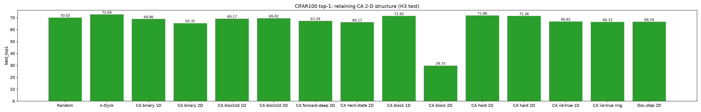

# H3 verdict — retaining CA's 2-D spacetime structure did *not* recover transfer

**Status:** results + verdict report (no new runs). Reads the committed `results/reports/*/metrics.json`
from the 18-run sweep launched by `scripts/run_ca_2d_experiments.sh` on the GPU box. Pairs with the design
note [`../ca-2d-spacetime/report.md`](../ca-2d-spacetime/report.md) (what was built and how to read it), the
pipeline walk-through [`../ca-spatial-input-analysis/report.md`](../ca-spatial-input-analysis/report.md)
(what the network actually ingests), and the five-hypothesis post-mortem
[`../ca-failure-analysis/report.md`](../ca-failure-analysis/report.md) (where H3 came from).

## 0. Bottom line

- **The experiment failed to recover CA transfer.** Exposing the 2-D spacetime geometry — through a
  `sincos2d`/`sincos1d` positional code, `block2d`/`forward` masking, and a genuinely-2-D Game-of-Life
  operator — did **not** lift CA toward k-Dyck. In the cleanest single-factor test it made transfer **worse**
  (CA binary `random`-pos 68.86 → `sincos2d` 65.35, **−3.51 pt**, and 4.67 pt *below* random init).
- **H3 is rejected as the binding constraint.** The flatten + structure-free position code is *not* what
  holds CA back. The remedy H3 prescribes (un-flatten, expose adjacency) is at best neutral and here is
  mildly harmful. H3 correctly named a *symptom* (the model learns a cheap local lookup) but mis-identified
  the *cause* (the rule is local + deterministic, so it learns a lookup no matter how you encode position).
- **The load-bearing null replicated.** With the board's adjacency now exposed, the 1-D ECA next-state
  operator *still* shows zero operator transfer: `true` 66.33 ≈ `shuffled` 66.36 (gap **−0.03**), matching
  the original 66.81 ≈ 66.90. Exposing geometry did not open the gap → the constraint is operator
  locality/determinism, not the flatten.
- **Is the CA rule just a worse pretraining task than k-Dyck? For this transfer objective — yes.** Every
  diagnostic that isolates *CA-operator* transfer comes back ≈ 0; the only gains CA ever shows come from
  generic, non-CA-specific levers (vocabulary via block tokenization, non-locality via forward masking) and
  still top out ~1 pt below k-Dyck. The right next step is the planned pivot to **2-D Dyck**, not "more
  spatial CA."
- **One caveat in CA's favour, and one broken run.** The genuinely-2-D Game-of-Life operator shows the *only*
  positive operator signal (`true` 66.54 vs `shuffled` 65.12, **+1.42 pt**) — real but far too small to
  matter (still 3.5 pt below random). And `cifar100-block-2dpos` (29.75) is a **failed warm-up**
  (acc 0.346), not a finding — exclude it.

## 1. The hypothesis and the experiments, in plain terms

**H3 (from [`../ca-failure-analysis/report.md`](../ca-failure-analysis/report.md) §2.3):** CA underperforms
partly because its intrinsically-2-D spacetime diagram (time × space) is flattened **row-major** to a 1-D
token sequence (`p = t·W + x`) **and** handed a *structure-free random* positional code. So a cell's causal
parents `(t−1, x−1..x+1)`, which sit at sequence positions `p−W−1, p−W, p−W+1`, are geometrically hidden,
and the model settles on a non-transferable, position-indexed local lookup. **Prediction:** "un-flatten" —
make the 2-D geometry *usable* — and transfer should recover.

The architecture only lets 2-D structure enter through **two** channels (everything else — the token count,
the attention math — must stay fixed or it won't transfer; only `blocks + norm` survive the strip):

1. **The frozen positional code** — `sincos2d` maps `p → (p//W, p%W) = (time, space)`, handing the blocks the
   grid adjacency; `sincos1d` is the periodic ring code for the 196-cell ECA board.
2. **The masking geometry** — `block2d` masks contiguous time×space rectangles (kills the copy-a-neighbour
   shortcut); `forward` masks the last time-rows (predict the future = must iterate the rule).

`scripts/run_ca_2d_experiments.sh` runs 12 warm-up → strip → CIFAR-100 chains across three families and
draws the comparison bar chart:

| Family | Runs | What it isolates |
|---|---|---|
| **2×3 factorial** (binary tokens) | `2dpos`, `block2d`, `block2d-1dpos`, `forward-deep-2dpos`, `nextstate-2dpos`, `forward-2dpos` | "2-D via position" vs "2-D via objective" — the core H3 test |
| **"are the old mods still needed"** | `block-2dpos`, `hard-2dpos` | does `sincos2d` add on top of the best 1-D recipe (block vocab + forward)? |
| **next-state operator controls** | `iid-true/shuffled-1dpos` (ECA ring), `gol-true/shuffled-2dpos` (Game of Life) | re-run the *failed* "predict the whole next state" objective with adjacency now **exposed**; `true−shuffled` = the operator-transfer signal |

## 2. The results

All CIFAR-100, ViT-tiny, 300 epochs, best top-1, verbatim from `metrics.json`. Baselines in *italics*.

| # | Init source | Run | Pos code | Mask / objective | Vocab K | **Best top-1** | Δ vs random |
|---:|---|---|---|---|---:|---:|---:|
| — | *k-Dyck* | `cifar100-dyck` | random | close-only recon | 130 | ***72.64*** | *+2.62* |
| 1 | CA hard (1-D) | `cifar100-hard` | random | block + forward | 130 | 71.86 | +1.84 |
| 2 | CA block (1-D) | `cifar100-block` | random | random recon | 130 | 71.42 | +1.40 |
| 3 | CA hard (2-D) | `cifar100-hard-2dpos` | **sincos2d** | block + forward | 130 | 71.36 | +1.34 |
| — | *Random init* | `cifar100-random` | — | — | — | ***70.02*** | *0.00* |
| 4 | CA block2d (2-D) | `cifar100-block2d` | **sincos2d** | block2d recon | 4 | 69.42 | −0.60 |
| 5 | CA block2d (1-D) | `cifar100-block2d-1dpos` | random | block2d recon | 4 | 69.17 | −0.85 |
| 6 | CA binary (1-D) | `cifar100-rule110` | random | random recon | 4 | 68.86 | −1.16 |
| 7 | CA forward-deep (2-D) | `cifar100-forward-deep-2dpos` | **sincos2d** | forward-12 recon | 4 | 67.24 | −2.78 |
| 8 | *CA iid-true (1-D, orig)* | `cifar100-iid-true` | random | transduction | 4 | 66.81 | −3.21 |
| 9 | GoL next-state **true** | `cifar100-gol-true-2dpos` | **sincos2d** | transduction | 4 | 66.54 | −3.48 |
| 10 | CA iid-**shuffled** ring | `cifar100-iid-shuffled-1dpos` | **sincos1d** | transduction | 4 | 66.36 | −3.66 |
| 11 | CA iid-**true** ring | `cifar100-iid-true-1dpos` | **sincos1d** | transduction | 4 | 66.33 | −3.69 |
| 12 | CA next-state (2-D) | `cifar100-nextstate-2dpos` | **sincos2d** | forward-1 recon | 4 | 66.17 | −3.85 |
| 13 | **CA binary (2-D)** | `cifar100-2dpos` | **sincos2d** | random recon | 4 | **65.35** | **−4.67** |
| 14 | GoL next-state **shuffled** | `cifar100-gol-shuffled-2dpos` | **sincos2d** | transduction | 4 | 65.12 | −4.90 |
| 15 | CA forward-shallow (2-D) | `cifar100-forward-2dpos` | **sincos2d** | forward-7 recon | 4 | 65.08 | −4.94 |
| ⚠ | CA block (2-D) — **broken** | `cifar100-block-2dpos` | sincos2d | random recon | 130 | 29.75 | −40.27 |

Read top to bottom: **the only runs above random are the three that use the 1-D `block`/`hard` recipe** (rows
1–3) — and the best of those, `hard` (71.86), uses the *random* 1-D position code. Every cell whose headline
feature is "2-D geometry exposed" lands **below random**, the cleanest one (row 13) furthest below.

## 3. Reading the four signals that actually decide H3

Headline accuracy alone can't separate "CA computation transferred" from "we installed a generic locality
prior." Four contrasts do, and all four point the same way.

**(1) The pure H3 lever — change *only* the position code — hurts.**
`ca-rule110` (random pos) → `ca-rule110-2dpos` (sincos2d) changes nothing but the positional embedding:
**68.86 → 65.35 (−3.51 pt).** Handing the blocks the exact (time, space) adjacency H3 says is missing made
transfer *worse*. (Adding `sincos2d` to k-Dyck also costs 0.45 pt: 72.64 → 72.19. The 2-D code is a mild
*liability* in this pipeline, not the missing ingredient.) This is the single most direct refutation of H3's
remedy.

**(2) The pos×mask interaction is ≈ 0.**
Holding mask mode fixed at `block2d` and flipping only the position code: `block2d-1dpos` 69.17 vs `block2d`
69.42 = **+0.25 pt** (noise). So even where a 2-D *objective* removes the copy-a-neighbour shortcut, adding
the 2-D *position* on top buys nothing. The design report's decision tree asked whether the bottom-right cell
(2-D pos × non-local objective) would be the one that clears random — it does not: `forward-deep-2dpos` 67.24
< random 70.02.

**(3) The next-state true−shuffled gap stays at zero with adjacency exposed — the load-bearing null.**
The original `ca_step` result was decisive precisely because `true` ≈ `shuffled` (66.81 ≈ 66.90) proved the
model learned the rule's *marginal*, not its *operator*. We re-ran it with the board's adjacency now exposed
(196-cell `sincos1d` ring):

| Operator | Pos code | true | shuffled | **gap** |
|---|---|---:|---:|---:|
| 1-D ECA next-state (orig) | random | 66.81 | 66.90 | −0.09 |
| 1-D ECA next-state (ring exposed) | **sincos1d** | 66.33 | 66.36 | **−0.03** |
| 2-D Game of Life | **sincos2d** | 66.54 | 65.12 | **+1.42** |

Exposing the ring geometry did **not** open the ECA gap — it stayed ≈ 0. This is the cleanest possible
disproof of "the flatten/position code was hiding a transferable operator": when we hand the model the
adjacency *and* a true-vs-shuffled control, the causal operator still contributes nothing downstream. The
binding constraint is the operator's **locality + determinism**, not how its coordinates were encoded.

The one non-zero gap is **Game of Life (+1.42)** — a genuinely-2-D operator (Moore-8 neighbourhood) whose
geometry `sincos2d` actually matches. It is real (marginal-matched, so the +1.42 is not a density artifact)
and it is the *only* positive operator signal in the whole study. But 66.54 is still 3.5 pt **below random**,
so it is a curiosity, not a rescue: a 2-D operator carries *slightly* more transferable structure than a 1-D
one, nowhere near enough to make the next-state objective viable.

**(4) The warm-up-accuracy paradox — the tasks the model fits easiest transfer the worst.**

| Run | Warm-up acc | Best top-1 |
|---|---:|---:|
| `ca-iid1step-true-1dpos` (next-state, 1-D) | **0.968** | 66.33 |
| `ca-rule110` (binary recon, 1-D) | **0.946** | 68.86 |
| `gol-step-true-2dpos` (next-state, 2-D) | 0.933 | 66.54 |
| `dyck-vit-t` (close-only recon) | 0.835 | **72.64** |
| `ca-rule110-2dpos` (binary recon, sincos2d) | 0.562 | 65.35 |

A 1-bit, deterministic, *local* rule under i.i.d. masking is solved to 95–97% by **memorising the 8-entry
lookup table and reading the visible neighbours** — no long-range computation, nothing a ViT wants. k-Dyck's
close-only objective *can't* be shortcut that way (a masked closer needs the matching opener off the stack),
so it tops out lower in warm-up and learns transferable machinery. Note row 5: `sincos2d` *removes* the
per-position fingerprints that made the lookup memorisable, so warm-up accuracy collapses to 0.56 (near the
binary floor) — the model is *forced* toward the "right" translation-equivariant stencil — and transfer
*still* dropped to 65.35. Forcing the better computation via geometry did not rescue transfer. (Direct
support for **H1 locality** and **H4 determinism** in the failure analysis.)

## 4. Why it failed

The premise was that CA's spatial structure was present in the data but *hidden by the encoding*, so making
it visible would let it transfer. The results say the structure was never the bottleneck:

1. **A local deterministic CA step does not *require* any transferable computation to predict.** Whatever
   positional code or mask shape you use, the optimal solution is a translation-equivariant stencil lookup
   (§3.4). That is a fine depthwise-conv locality prior, but it is *not* the long-range, stateful computation
   that makes a warm-up transfer — and a ViT can pick up locality cheaply on its own, so transferring it adds
   little (and the specialization the blocks acquire has to be partly *un*learned on images, which is how CA
   lands *below* random).
2. **The two usable spatial channels are weak by construction.** A *frozen additive* positional code tells
   the blocks *where* a token is but does not *bias attention toward neighbours* — and it is **stripped at
   transfer**, so it only ever shaped *what the blocks learned*, never what vision sees. The mask shape is
   the only other lever. The genuinely spatial encodings (per-row "whole next state" tokens, 2-D RoPE, a conv
   stem) all change `N≠196` or the attention math and **break transfer** — see
   [`../ca-2d-spacetime/report.md`](../ca-2d-spacetime/report.md) §6. So "make it more spatial" hits a ceiling
   the interface imposes, and we were already at it.
3. **Each cell is one bit.** With binary tokens the frozen 4-row identity embedding gives a cell ~1 bit of
   *content*; a glider or a triangle is never presented as content, only as a configuration of 1-bit tokens.
   `block` tokenization adds vocabulary (and is the only lever that reliably helped) but does so by
   coarsening 7 cells into one symbol — it buys vocabulary by *destroying* the spatial resolution we were
   trying to expose.
4. **`sincos2d` mis-encodes the torus.** Both the ECA ring and the Life board wrap, but `sincos2d` is
   non-periodic, so ~27% of border cells' wrap-neighbours are not exposed as adjacent. This is conservative
   (it can only *hide* a real signal, and it cancels in the true−shuffled gap), but it means the 2-D geometry
   we handed the model was imperfect for these specific automata anyway.

The failure is over-determined by **non-spatial** causes — locality, determinism, vocabulary poverty — that
the data confirms directly. "Capture the geometry better" was never going to fix a task that doesn't need
geometry to be solved.

> **Exclude the 29.75 outlier.** `cifar100-block-2dpos` (block tokenization K=130 + random recon +
> `sincos2d`) is a **failed warm-up**: final warm-up loss 2.50, acc **0.346** (vs 0.10–0.29 elsewhere) — the
> blocks never converged, then poisoned transfer. The pairing of a 128-way categorical target with the
> low-rank `sincos2d` code at the default LR appears to have diverged. Treat it as an artifact and re-run
> with a gentler warm-up LR before citing it; it carries no information about geometry.

## 5. Can I reject H3?

**Yes — reject H3 as the explanation for CA's gap and as a remedy.** Precisely:

- **The causal claim is refuted.** "Exposing the 2-D adjacency recovers CA transfer" is false: the
  single-factor test made it *worse* (−3.51 pt, §3.1), the pos×mask interaction is ≈ 0 (§3.2), `sincos2d`
  costs k-Dyck 0.45 pt too, and adding `sincos2d` to the best 1-D recipe *removes* 0.5 pt (`hard` 71.86 →
  `hard-2dpos` 71.36). The flatten + structure-free position code is **not** the binding constraint.
- **The diagnostic claim is confirmed but re-attributed.** H3's *mechanism* — the model settles on a local
  lookup — is real (warm-up acc 0.95 by lookup; it collapses to 0.56 once `sincos2d` removes the per-position
  fingerprints). But the lookup is driven by the rule being **local + deterministic**, not by hidden
  geometry: with geometry fully exposed the lookup persists and the true−shuffled gap stays at zero (§3.3).
  H3 found the right symptom and the wrong cause.

So this is not "H3 is untested / inconclusive" — it is the specific branch the design report's decision tree
flagged as the falsifier: *"next-state true−shuffled gap stays ~0 even with adjacency exposed → the binding
constraint is operator locality/determinism, not the flatten → H3 insufficient; pivot to the
intrinsically-2-D 2-D-Dyck sources."* That branch fired.

## 6. Is the CA rule just a worse pretraining task than k-Dyck?

**For this transfer objective, yes — and the limitation is intrinsic to the CA operator, not to how we fed
it.** Three observations:

1. **In absolute transfer, CA never reaches k-Dyck.** Best CA = `hard` 71.86 (best-seed k-Dyck = 72.80,
   `cifar100-dyck-s1`); most CA variants sit below random init. The geometry fixes did not close the ~1 pt
   top-end gap and did not lift the sub-random tail.
2. **Every CA-*operator*-isolating diagnostic returns ≈ 0.** The 1-D ECA true−shuffled gap is ≈ 0 with the
   geometry hidden *and* with it exposed (−0.09, −0.03). The modest gains CA *does* show come entirely from
   **generic levers that are not CA-specific** — vocabulary (block tokenization → 130 types) and a non-local
   objective (forward masking) — and both are available to *any* source. Strip those away and the cellular
   automaton's *computation* contributes essentially nothing transferable.
3. **k-Dyck forces exactly what CA doesn't.** Its close-only objective on a stochastic, stack-constrained,
   128-vocab grammar demands long-range binding (stack tracking), a rich type space, and learning a
   *constraint distribution* rather than memorising a deterministic map — the three transferable computations
   the failure analysis identified. A local deterministic CA step demands none of them.

The honest qualifier: it is not that CA teaches *nothing 2-D* — Game of Life's +1.42 true−shuffled gap shows
a genuinely-2-D operator carries *some* transferable signal that a 1-D ECA does not. But it is far too small
(still 3.5 pt below random) to make CA competitive. So CA, as a *next-state / spacetime* warm-up source, is a
worse substrate than k-Dyck, and no amount of "feed the geometry better" changes that within the transfer
interface's constraints.

## 7. What this licenses next

Both prior reports and this one's decision-tree branch converge on the same move, and the evidence now backs
it rather than merely motivating it:

- **Stop treating geometry as the lever.** The `sincos2d × random` cell did not recover (it dropped); the
  *objective* (vocabulary + non-locality), not the position code, is what moves the needle — and it needs no
  2-D code (`hard`, 1-D, 71.86).
- **Pivot to 2-D Dyck** (`docs/2307.16522.pdf`,
  [`../dyck2d-pretraining-design/report.md`](../dyck2d-pretraining-design/report.md)): keep k-Dyck's
  transferable properties (long-range binding, rich vocabulary, a *constraint distribution* instead of a
  deterministic map) **and** add *genuine* 2-D structure — not a re-layout of a 1-D source (which
  `spatial-dyck` already showed *hurts*: nested 70.42, permuted 66.93).
- **If pushing CA further at all, change the token, not the position** — an interface-safe patch-of-cells
  token (e.g. 2×2 blocks → a 16-way symbol on a 7×7 grid) raises per-cell information *without* collapsing a
  spatial axis the way `block`'s 1×7 rows do — and pair it with a `lightcone`-tip mask that *demands*
  multi-step composition (`data/ca/masking.py`, never run). Expect modest gains; it is still bounded by
  determinism/locality.
- **Re-run `block-2dpos`** with a gentler warm-up LR before any conclusion is drawn from its 29.75.

## 8. Provenance

- **Numbers:** `results/reports/<run>/metrics.json` (downstream: `best_top1`; warm-up: `final_avg_acc`,
  `final_avg_loss`, `masking`, `source`). Baselines `cifar100-{random,dyck,rule110,block,hard,iid-true}` from
  the earlier sweeps; new runs from `scripts/run_ca_2d_experiments.sh` (12 chains).
- **Figure:** `results/figures/ca_2d_spacetime_cifar100.png` (auto-generated by
  `procedural_warmup.analysis.compare`; the broken `block-2dpos` bar at 29.75 is the visible outlier).
- **Companion reports:** design [`../ca-2d-spacetime/report.md`](../ca-2d-spacetime/report.md); pipeline
  [`../ca-spatial-input-analysis/report.md`](../ca-spatial-input-analysis/report.md); post-mortem
  [`../ca-failure-analysis/report.md`](../ca-failure-analysis/report.md); next direction
  [`../dyck2d-pretraining-design/report.md`](../dyck2d-pretraining-design/report.md).

_Generated as an analysis report (no new runs) on branch `feat/ca-2d-spacetime-no-flatten`._
