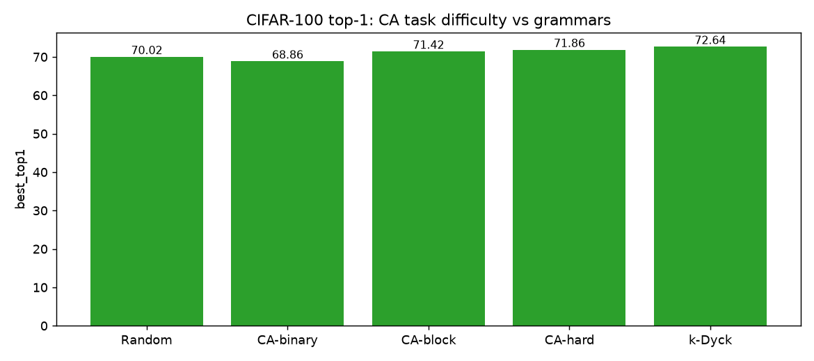

# CIFAR-100 top-1: CA task difficulty vs grammars

_Generated 2026-06-24T15:39:51Z_

## Results

| init | run | best top-1 | dataset |
|---|---|---|---|
| Random | `cifar100-random` | 70.02 | CIFAR100 |
| CA-binary | `cifar100-rule110` | 68.86 | CIFAR100 |
| CA-block | `cifar100-block` | 71.42 | CIFAR100 |
| CA-hard | `cifar100-hard` | 71.86 | CIFAR100 |
| k-Dyck | `cifar100-dyck` | 72.64 | CIFAR100 |

## Summary

Best initialization: **k-Dyck** (72.64% top-1).

Success criterion (Stage 1): the CA (Rule 110) warm-up should match or exceed random initialization, ideally approaching or beating k-Dyck.

## Figures

