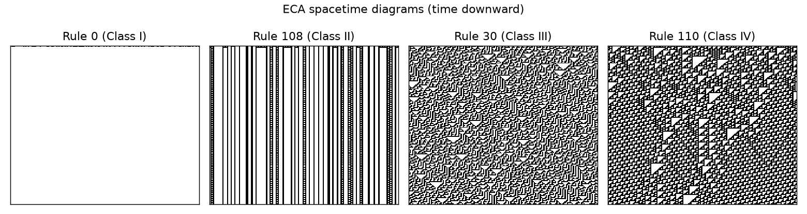

# Cellular-automata generator validation

_Generated 2026-06-22T17:59:11Z_

## Spacetime diagrams

Representative rules per Wolfram class (time flows downward). Rule 0 is homogeneous (I), 108 periodic (II), 30 chaotic (III), 110 complex/edge-of-chaos (IV).

## Complexity ordering (Lempel-Ziv)

Operational complexity used as the independent variable for the rule sweep, ascending:

| rule | class | LZ | LZ (norm) | density |
|---|---|---|---|---|
| 0 | I | 255 | 0.117 | 0.000 |
| 32 | I | 255 | 0.117 | 0.000 |
| 160 | I | 255 | 0.117 | 0.000 |
| 250 | II | 255 | 0.117 | 1.000 |
| 90 | III | 255 | 0.117 | 0.000 |
| 137 | IV | 2083 | 0.954 | 0.429 |
| 108 | II | 2205 | 1.009 | 0.316 |
| 54 | IV | 2240 | 1.025 | 0.484 |
| 193 | IV | 2297 | 1.051 | 0.434 |
| 110 | IV | 2564 | 1.174 | 0.557 |
| 150 | III | 3274 | 1.499 | 0.500 |
| 30 | III | 3282 | 1.502 | 0.499 |

## Figures

