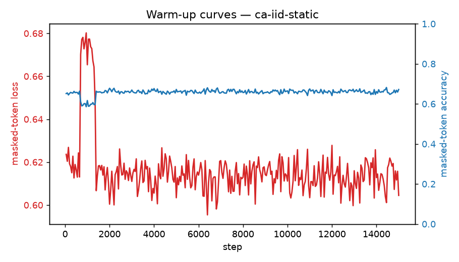

# Warm-up run: ca-iid-static

_Generated 2026-06-24T23:33:16Z_

## Configuration

- source: `iid_board`
- masking: `random` @ ratio 0.5
- steps: 15000, batch 256
- optimizer: AdamW lr=0.002 wd=0.05

## Result

Final masked-token loss (running avg): **0.6173**; accuracy: **0.658**.

Stripped checkpoint for transfer: run `process.py` on `checkpoints/ca-iid-static/ckpt_step_015000.pt`.

## Figures

