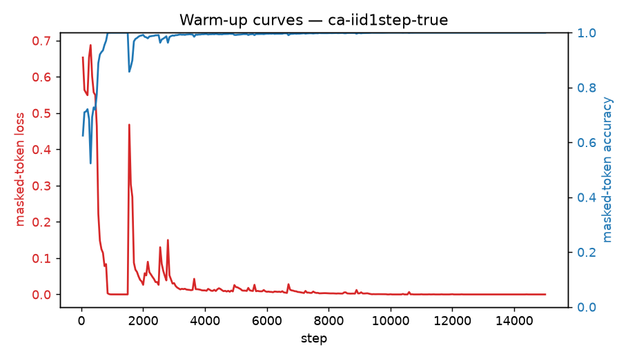

# Warm-up run: ca-iid1step-true

_Generated 2026-06-24T21:11:47Z_

## Configuration

- source: `ca_step`
- masking: `random` @ ratio 0.5
- steps: 15000, batch 256
- optimizer: AdamW lr=0.002 wd=0.05

## Result

Final masked-token loss (running avg): **0.0355**; accuracy: **0.983**.

Stripped checkpoint for transfer: run `process.py` on `checkpoints/ca-iid1step-true/ckpt_step_015000.pt`.

## Figures

