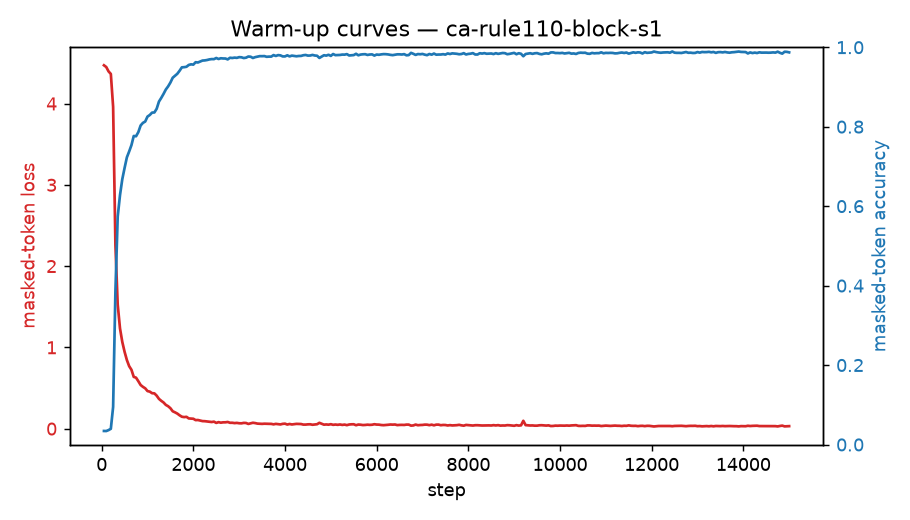

# Warm-up run: ca-rule110-block-s1

_Generated 2026-06-24T21:29:28Z_

## Configuration

- source: `ca` (rule 110)
- masking: `random` @ ratio 0.5
- steps: 15000, batch 256
- optimizer: AdamW lr=0.002 wd=0.05

## Result

Final masked-token loss (running avg): **0.1798**; accuracy: **0.947**.

Stripped checkpoint for transfer: run `process.py` on `checkpoints/ca-rule110-block-s1/ckpt_step_015000.pt`.

## Figures

