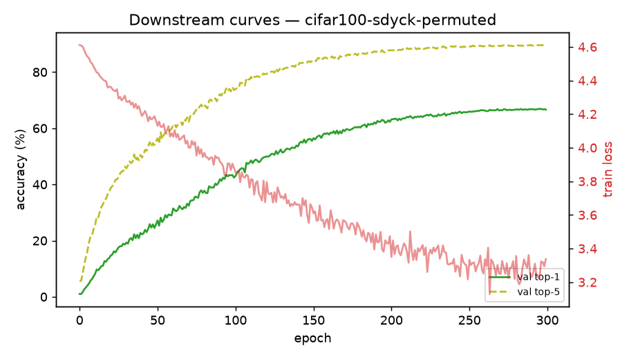

# Downstream run: cifar100-sdyck-permuted

_Generated 2026-06-26T00:07:00Z_

## Configuration

- dataset: **CIFAR100** (224px)
- init: `checkpoints/spatial-dyck-permuted/ckpt_step_015000_stripped.pt`
- model: vit_tiny_patch16_224, 300 epochs, AdamW lr=0.002 wd=0.05
- aug: mixup=0.8 cutmix=1.0 smoothing=0.1

## Result

Best top-1: **66.93%** (final 66.62%, top-5 89.55%).

## Figures

