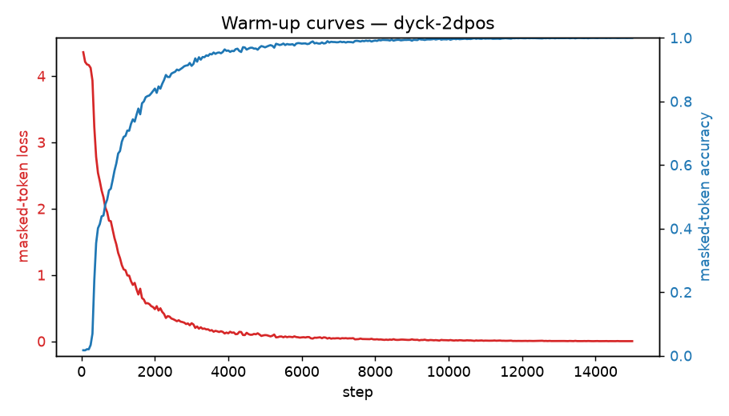

# Warm-up run: dyck-2dpos

_Generated 2026-06-25T22:42:34Z_

## Configuration

- source: `dyck`
- masking: `random` @ ratio 0.5
- steps: 15000, batch 256
- optimizer: AdamW lr=0.002 wd=0.05

## Result

Final masked-token loss (running avg): **0.2971**; accuracy: **0.920**.

Stripped checkpoint for transfer: run `process.py` on `checkpoints/dyck-2dpos/ckpt_step_015000.pt`.

## Figures

