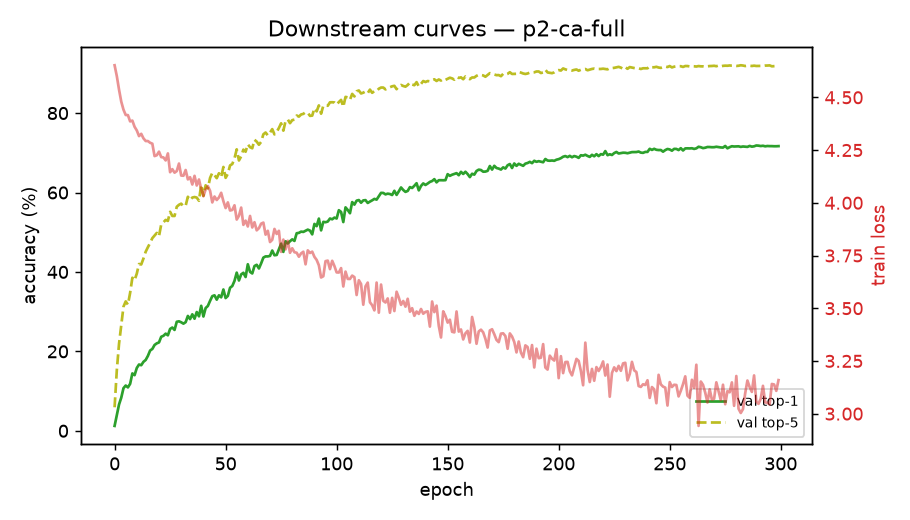

# Downstream run: p2-ca-full

_Generated 2026-06-25T17:12:58Z_

## Configuration

- dataset: **CIFAR100** (224px)
- init: `random init (no warm-up)`
- model: vit_tiny_patch16_224, 300 epochs, AdamW lr=0.002 wd=0.05
- aug: mixup=0.8 cutmix=1.0 smoothing=0.1

## Result

Best top-1: **71.84%** (final 71.68%, top-5 92.00%).

## Figures

