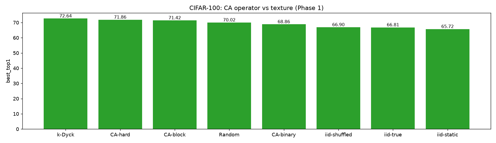

# CIFAR-100: CA operator vs texture (Phase 1)

_Generated 2026-06-25T00:11:23Z_

## Results

| init | run | best top-1 | dataset |
|---|---|---|---|
| k-Dyck | `cifar100-dyck` | 72.64 | CIFAR100 |
| CA-hard | `cifar100-hard` | 71.86 | CIFAR100 |
| CA-block | `cifar100-block` | 71.42 | CIFAR100 |
| Random | `cifar100-random` | 70.02 | CIFAR100 |
| CA-binary | `cifar100-rule110` | 68.86 | CIFAR100 |
| iid-shuffled | `cifar100-iid-shuffled` | 66.90 | CIFAR100 |
| iid-true | `cifar100-iid-true` | 66.81 | CIFAR100 |
| iid-static | `cifar100-iid-static` | 65.72 | CIFAR100 |

## Summary

Best initialization: **k-Dyck** (72.64% top-1).

Success criterion (Stage 1): the CA (Rule 110) warm-up should match or exceed random initialization, ideally approaching or beating k-Dyck.

## Figures

