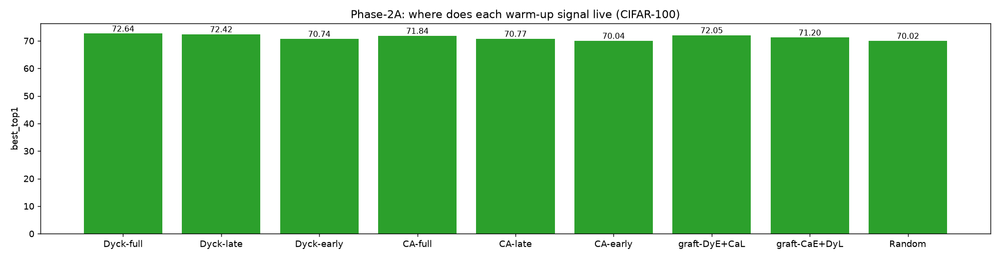

# Phase-2A: where does each warm-up signal live (CIFAR-100)

_Generated 2026-06-25T20:52:57Z_

## Results

| init | run | best top-1 | dataset |
|---|---|---|---|
| Dyck-full | `cifar100-dyck` | 72.64 | CIFAR100 |
| Dyck-late | `p2-dyck-late` | 72.42 | CIFAR100 |
| Dyck-early | `p2-dyck-early` | 70.74 | CIFAR100 |
| CA-full | `p2-ca-full` | 71.84 | CIFAR100 |
| CA-late | `p2-ca-late` | 70.77 | CIFAR100 |
| CA-early | `p2-ca-early` | 70.04 | CIFAR100 |
| graft-DyE+CaL | `p2-graft-dyckE-caL` | 72.05 | CIFAR100 |
| graft-CaE+DyL | `p2-graft-caE-dyckL` | 71.20 | CIFAR100 |
| Random | `cifar100-random` | 70.02 | CIFAR100 |

## Summary

Best initialization: **Dyck-full** (72.64% top-1).

Success criterion (Stage 1): the CA (Rule 110) warm-up should match or exceed random initialization, ideally approaching or beating k-Dyck.

## Figures

