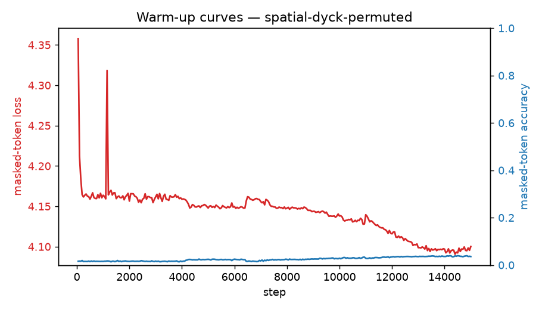

# Warm-up run: spatial-dyck-permuted

_Generated 2026-06-25T23:28:31Z_

## Configuration

- source: `spatial_dyck`
- masking: `random` @ ratio 0.5
- steps: 15000, batch 256
- optimizer: AdamW lr=0.002 wd=0.05

## Result

Final masked-token loss (running avg): **4.1429**; accuracy: **0.025**.

Stripped checkpoint for transfer: run `process.py` on `checkpoints/spatial-dyck-permuted/ckpt_step_015000.pt`.

## Figures

