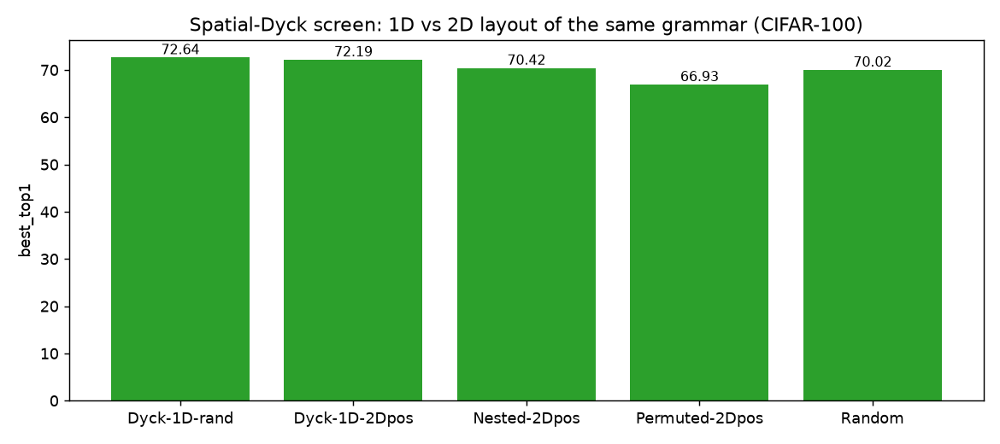

# Spatial-Dyck screen: 1D vs 2D layout of the same grammar (CIFAR-100)

_Generated 2026-06-26T00:09:08Z_

## Results

| init | run | best top-1 | dataset |
|---|---|---|---|
| Dyck-1D-rand | `cifar100-dyck` | 72.64 | CIFAR100 |
| Dyck-1D-2Dpos | `cifar100-dyck-2dpos` | 72.19 | CIFAR100 |
| Nested-2Dpos | `cifar100-sdyck-nested` | 70.42 | CIFAR100 |
| Permuted-2Dpos | `cifar100-sdyck-permuted` | 66.93 | CIFAR100 |
| Random | `cifar100-random` | 70.02 | CIFAR100 |

## Summary

Best initialization: **Dyck-1D-rand** (72.64% top-1).

Success criterion (Stage 1): the CA (Rule 110) warm-up should match or exceed random initialization, ideally approaching or beating k-Dyck.

## Figures

